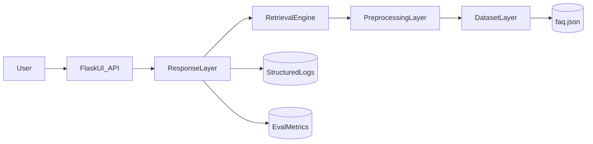
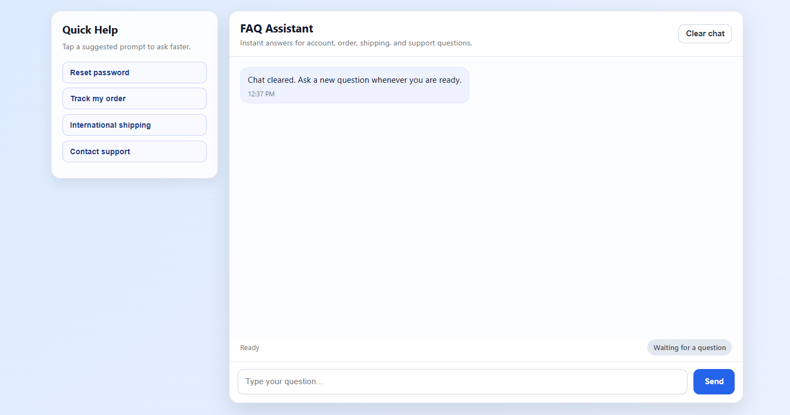

# FAQ Chatbot

A professional FAQ chatbot built with Flask and Sentence Transformers. The project demonstrates a clean four-layer architecture, semantic retrieval, structured logging, robust malformed-dataset loading, a polished web UI, and automated tests designed for junior AI/ML portfolio review.

## Features

- Semantic FAQ retrieval using `all-MiniLM-L6-v2`
- Four clear layers:
  - Dataset layer
  - Preprocessing layer
  - Retrieval engine
  - Response layer
- Robust loader for malformed or mixed JSON FAQ files
- Confidence-aware fallback responses
- Structured request and chat logging
- Professional web interface with:
  - quick prompts
  - timestamps
  - status updates
  - local chat persistence
  - clear chat action
- Automated test suite and CI workflow

## Architecture



## Project Structure

```text
faq_chatbot/
├── app/
│   ├── api.py
│   ├── chatbot.py
│   ├── config.py
│   ├── preprocessing.py
│   ├── retrieval.py
│   └── routes.py
├── data/
│   ├── eval_set.json
│   └── faq.json
├── static/
│   ├── css/style.css
│   └── js/chat.js
├── templates/
│   └── index.html
├── tests/
├── utils/
│   ├── file_loader.py
│   └── logger.py
├── .github/workflows/ci.yml
├── requirements.txt
└── run.py
```

## Setup

1. Clone the repository:

```bash
git clone <your-repo-url>
cd faq_chatbot
```

2. Create and activate a virtual environment.
3. Install dependencies:

```bash
pip install -r requirements.txt
```

4. Start the application:

```bash
python run.py
```

5. Open the UI:

[http://127.0.0.1:5000/](http://127.0.0.1:5000/)

## Dependencies

Main runtime and quality dependencies are listed in:

- `requirements.txt` (pip-based setup)
- `pyproject.toml` (project metadata and dependency definitions)

## Environment Variables

Optional environment variables:

- `FAQ_DATA_PATH` - path to the FAQ dataset
- `EMBEDDING_MODEL` - sentence-transformers model name
- `CONFIDENCE_THRESHOLD` - fallback threshold between `0.0` and `1.0`
- `TOP_K` - number of suggestions to keep
- `FLASK_HOST` - host for the Flask server
- `FLASK_PORT` - port for the Flask server
- `FLASK_DEBUG` - `true` or `false`
- `LOG_LEVEL` - logging level such as `INFO`

## API Example

### Request

```bash
curl -X POST http://127.0.0.1:5000/chat ^
  -H "Content-Type: application/json" ^
  -d "{\"message\":\"I forgot my password\"}"
```

### Response

```json
{
  "success": true,
  "response": "Click 'Forgot Password' on the login page and follow the reset instructions.",
  "meta": {
    "request_id": "generated-request-id",
    "score": 0.91,
    "matched": true,
    "confidence": "high",
    "suggestions": [
      "How can I reset my password?",
      "How do I change my password?"
    ],
    "latency_ms": 42.17
  },
  "error": null
}
```

## Testing

Run the unit and route tests:

```bash
python -m unittest discover -s tests -v
```

Or with coverage:

```bash
pytest --cov=app --cov=utils --cov-report=term-missing tests
```

## Reproducibility Checklist

This repository is submission-ready when the following commands work on a fresh clone:

```bash
pip install -r requirements.txt
python -m unittest discover -s tests -v
python run.py
```

Expected outcome:

- tests pass
- Flask app starts successfully
- UI loads in browser and `/chat` returns structured JSON

## Submission Notes

- Submit this project as a GitHub repository URL.
- Ensure this `README.md` remains at repo root.
- Keep `.env` out of version control (already handled by `.gitignore`).
- Keep dataset, tests, scripts, and setup instructions committed for reviewer reproducibility.

## Evaluation

### UI Preview



```bash
python scripts/evaluate_chatbot.py
```

This uses `data/eval_set.json` to report:

- response expectation accuracy
- match-state accuracy
- fallback rate

## Why This Project Is Strong For Interviews

- Demonstrates AI/ML integration in a usable product
- Uses semantic retrieval rather than exact string matching
- Includes professional backend concerns:
  - config validation
  - standardized API schema
  - structured logs
  - error handling
  - test automation
- Shows frontend polish and practical UX thinking

## Current Limitations

- Evaluation dataset is intentionally small and should be expanded
- The project uses JSON storage rather than a production database
- The retrieval layer is semantic-only; a hybrid retriever would improve edge cases

## Future Improvements

- Hybrid retrieval with lexical + semantic scoring
- Feedback loop for unanswered questions
- Admin dashboard for analytics
- Docker deployment
- Screenshot or GIF demo in the README
